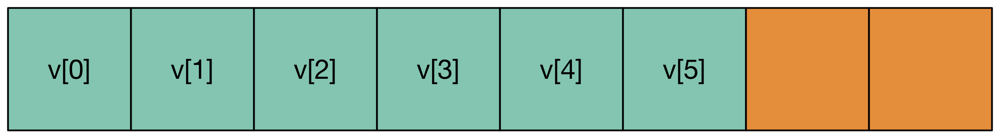
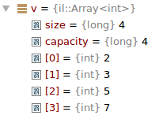

.. role:: cpp(code)

    :language: cpp

Array
=====

Overview
--------

The dynamic array :cpp:`il::Array<T>` is our own implementation of the popular
:cpp:`std::vector<T>` of the standard library. It is a container that stores
elements of type :cpp:`T` in contiguous locations of the memory. Its size
:cpp:`n` can change during the lifetime of the object.

Let's dive into our first example and look at the following code that creates an
array of :cpp:`n` floating point numbers and stores the inverse of the first
:cpp:`n` positive integers.

.. code-block:: cpp

    #include <il/Array.h>

    const il::int_t n = 100;
    il::Array<double> v{n};
    for (il::int_t i = 0; i < n; ++i) {
      v[i] = 1.0 / (1 + i);
    }

In this example, the size of the array is defined at the construction of the
object and is fixed in this code. But their size an grow or shrink during the
lifetime of the object. You can use the :cpp:`Append` method to add an element
at the end of an array. The following function takes an array :cpp:`v` and
returns the array containing all the positive elements of :cpp:`v`.

.. code-block:: cpp

    #include <il/Array.h>

    il::Array<double> f(const il::Array<double>& v) {
      il::Array<double> ans{};
      for (il::int_t i = 0; i < v.size(); ++i) {
        if (v[i] > 0) {
          ans.Append(v[i]);
        }
      }
      return ans;
    }

The default constructor creates an array of size 0 and every time the
:cpp:`Append` method is called, the array size grows by 1 and the new element is
placed at the end of the array.

To store its elements, the array :cpp:`v` allocates memory on the heap. As an
array must always store all of its elements in contiguous locations of the
memory, when its size grows from :cpp:`n0` to :cpp:`n1`, the array might need to
allocate a new memory chunk of size :cpp:`n1`, and copy the first :cpp:`n0`
elements to the new location. As memory allocation takes some time,
:cpp:`il::Array<T>` tries to minimize the number of such reallocations. In order
to do that, an array has a capacity :cpp:`r` which is larger that its size
:cpp:`n`. The array has the room to store :cpp:`r` elements on the memory chunk
that has been allocated, and as long as the size of the array stays below
:cpp:`n`, resizing the array is a fast operation.

The above image represents an array of size 6 with its elements :cpp:`v[0]` to
:cpp:`v[5]` which are stored in contiguous location of the memory. The capacity
of this array is 8, which is represented by the two orange locations at the
end of the array that can be used to append two elements to it without any
reallocation.

When the size of an array :cpp:`n` reaches its capacity, appending an element to
the array triggers an allocation of a new chunk of memory that can store about
:cpp:`2n` elements, the first :cpp:`n` elements of the array are copied to the
new location, and the new element is stored at the end. We say that the growth
factor of the dynamic array is 2. No memory allocation will be triggered until
the size of the array has reached :cpp:`2 * n`. If you have an upper bound for
the number of elements that will be used in the sequence, you can set the
capacity at the very beginning of the algorithm. In the previous algorithm, as
we know that :cpp:`ans` will contain less elements than :cpp:`v`, we can decide
to set the capacity of :cpp:`ans` to the size of :cpp:`v` at the very beginning.

.. code-block:: cpp

    #include <il/Array.h>

    il::Array<double> f(const il::Array<double>& v) {
      il::Array<double> ans{};
      ans.Reserve(v.size());
      for (il::int_t i = 0; i < v.size(); ++i) {
        if (v[i] > 0) {
          ans.Append(v[i]);
        }
      }
      return ans;
    }

That way, we can be sure that only one memory allocation will occur in this
function. Note that the capacity of an array is not part of the identity of
the object: the copy of an :cpp:`il::Array<T>` is not guaranteed to have the
same capacity of the original array.

Even though there are few internals difference, you can think as if the object
`il::Array<T>` was composed of a pointer to the first element of the array and
two integers: its size and its capacity.

Construction
------------

There are many different ways to construct an array.

1. The default constructor construct an array of size 0 and capacity 0. As a
   consequence, it does not allocate any memory and is extremely fast to
   execute.

   .. code-block:: cpp

       #include <il/Array.h>

       il::Array<double> v{};

2. It is also possible to construct an array giving its size :cpp:`n`. An array
   of size :cpp:`n` (and usually of the same capacity) will be constructed.

   .. code-block:: cpp

       #include <il/Array.h>

       const il::int_t n = 1000;
       il::Array<double> v{n};

   The initialization behavior of the elements depends upon the type :cpp:`T`.

   - For numeric types such as :cpp:`bool`, :cpp:`unsigned char`, :cpp:`char`,
     :cpp:`int`, :cpp:`il::int_t`, :cpp:`float`, :cpp:`double` the memory should
     be considered as uninitialized. Therefore, for such arrays, reading the
     element :cpp:`v[k]` before it has been set results in undefined behaviour.
     In practice:

     - In *release mode*, the memory is left *uninitialized*.
     - In *debug mode*, the memory is set to a special value that makes bugs
       that come from noninitialization easier to track. Floating point types
       are set to :cpp:`NaN` and integers are set to the largest number
       :cpp:`1234...` that the type can hold.

   - For objects, the elements are default constructed. As a consequence they
     are properly initialized. As a consequence, this constructor must be called
     with types :cpp:`T` with a default constructor. However, the `il::Array<T>`
     container also comes with constructors and methods that works with types
     that do not provide any default constructor.

3. One can also explicitly ask to construct an array of size :cpp:`n` with a
   default value supplied as a second argument. For instance, if you want to
   create an array of floating point with all the elements initialized to
   :cpp:`0.0`, one can use the following code:

   .. code-block:: cpp

       #include <il/Array.h>

       const il::int_t n = 1000;
       il::Array<double> v{n, 0.0};

4. The previous constructor is only available for types that can be copied.
   Unfortunately, there are some types such as :cpp:`std::atomic<int>` that
   cannot be copied. Other types may be expensive to copy. As a consequence,
   another constructor is available where you do not provide a default object,
   but arguments to construct this default object.

   .. code-block:: cpp

       #include <atomic>
       #include <il/Array.h>

       const il::int_t n = 1000;
       il::Array<std::atomic<int>> v{n, il::emplace, 0};

   the item :cpp:`il::emplace` is a keywork of the InsideLoop library which is
   used for disambiguation with the previous constructor.

5. Finally, in case you want to explicitly initialized the element to a default
   value, the following constructor can be used.

   .. code-block:: cpp

       #include <il/Array.h>

       il::Array<double> v{il::value, {1.0, 2.0}}

   The item :cpp:`il::value` is another keyword of the InsideLoop library, also
   needed for disambiguation. The constructor :cpp:`il::Array<int> v{3, 0}`
   creates an array of length 3 which is filled with 0, and the constructor
   :cpp:`il::Array<int> v{il::value, {3, 0}}` creates an array of length 2 that
   contains a 3 and a 0. You have to be careful when migrating code using
   :cpp:`std::vector<T>` as the behavior of the standard library is different.

Arrays own their memory. As a consequence, it is impossible to construct an
array from a pointer that has been allocated by :cpp:`malloc`, :cpp:`new` or
another library. If you want to warp such a pointer inside an InsideLoop object,
the type you are looking for are :cpp:`il::ArrayView<T>` and
:cpp:`il::ArrayEdit<T>`.

Copy construction and assignement
---------------------------------

Copy construction and assigment in C++ is designed to provide a fresh copy of
an object with the same identity. The identity of :cpp:`il::Array<T>` comes from
its size and the elements it holds. As a consequence, when you copy construct an
array, you are guarenteed to have a new array with the same size as the
original and with elements that should compare equal. Bare in mind that the
capacity of an array, which exists for optimization purpose, is not part of the
identity of an array. As a consequence, when you copy an array, you are not
guaranteed to keep the same capacity. Most of the times, the newly created
array will have its size and capacity equal.

1. **Copy construction**.
   When an array :cpp:`w` is constructed as a copy of the array :cpp:`v`, any
   change made to one of the array will not affect the other one. Two different
   arrays will never share the same part of memory. As a consequence, if
   :cpp:`w` is constructed from :cpp:`v`, it will allocate its own memory and
   copy all the elements of :cpp:`v` in it.

   .. code-block:: cpp

       #include <il/Array.h>

       il::Array<double> v{};
       ...
       il::Array<double> w = v;

   As arrays are expensive to copy. When they are passed to functions to be
   read, they should be passed by const reference.

   .. code-block:: cpp

       #include <il/Array.h>

       double sum(const il::Array<double>& v) {
         double ans = 0.0;
         for (il::int_t i = 0; i < v.size(); ++i) {
           ans += v[i];
         }
         return ans;
       }

   Sometimes, you need to transfer the ownership of the memory from :cpp:`v` to
   :cpp:`w`. For that, you should use the move constructor that will assign the
   memory chunk previously used by :cpp:`v` to the newly constructed array
   :cpp:`w`. After the move construction has been completed, :cpp:`v` will have
   a size and a capacity of 0.

   .. code-block:: cpp

       #include <il/Array.h>

       il::Array<double> v{};
       ...
       il::Array<double> w = std::move(v);

   You should not be afraid to return arrays from functions. Even though the
   semantics of C++ says that returned objects are copied, in practice return
   value optimization is done by the compiler and returning an array is cheap.
   In the very specific cases where return value optimization could not be done,
   the mode semantics are automatically generated by the compiler (please do not
   use :cpp:`return std::move(v)` that would prevent return value optimization).
   So please return arrays by value: they are cheap to return.

   In some special cases, it might be useful to pass an array to a constructor
   by copy to use the move semantics if you want. For instance, in the following
   code, no memory allocation happens at when the object filter is constructed,
   but the array :cpp:`weight` becomes empty after :cpp:`f` has been
   constructed.

   .. code-block:: cpp

       #include <il/Array.h>

       class Filter {
        private:
         il::Array<double> weight_;
        public:
         Filter(il::Array<double> weight) : weight_{std::move(weight)} {};
         ...
       }

       il::Array<double> weigth = ...;
       Filter f{std::move(weight)};

   In case, you want to continue to work with :cpp:`weight` after the
   construction of :cpp:`f`, one can remove the :cpp:`std::move` operator when
   constructing :cpp:`f`. As a consequence, passing arrays by value when
   you want to copy or transfer ownership of the memory is a good habit.

2. **Copy assignment**.
   The assignement follows the same behaviour where the full identity of an
   object is copied to another one. After the copy has been done, the two
   objects will behave independently: their memory does not alias.

   .. code-block:: cpp

       #include <il/Array.h>

       il::Array<double> v{};
       il::Array<double> w{};
       ...
       w = v;

   If the capacity of :cpp:`w` is larger than the size of :cpp:`v`, no memory
   allocation will be done and all the elements will be copied from :cpp:`v` to
   :cpp:`w`. Otherwise, a new memory chunk will be allocated to copy the
   elements of :cpp:`v` and the old memory chunk will be released.

   We also provide a move assignement in case you don't want to pay the price of
   the copy of the elements. As usual, after the move assignement the array
   :cpp:`v` will have its size and capacity set to 0.

   .. code-block:: cpp

      #include <il/Array.h>

      il::Array<double> v{};
      il::Array<double> w{};
      ...
      w = std::move(v);

Destruction
-----------

The destruction of an array releases its memory. If :cpp:`T` is a class, all the
objects contained in the array will be destructed in an unspecified order
before the memory is released.

Accessing the elements
----------------------

1. **Read access with the bracket operator**.
   The method :cpp:`size()` returns the size of the array as an :cpp:`il::int_t`.
   The elements can be accessed through the bracket operator. As a consequence,
   The following code can be used to compute the scalar product of two arrays. The
   :cpp:`il_EXPECT_FAST` macro is just here to check (only in debug mode) the
   precondition of this function which is to have two arrays of the same size.

   .. code-block:: cpp

       #include <il/Array.h>

       double scalarProduct(const il::Array<double>& v0, const il::Array<double>& v1) {
         IL_EXPECT_FAST(v0.size() == v1.size());

         const il::int_t n = v0.size();
         double ans = 0.0;
         for (il::int_t i = 0; i < n; ++i) {
           ans += v0[i] * v1[i];
         }
         return ans;
       }

   Accessing elements out of bound is forbidden. The behavior of the library is
   different, wether we are in debug mode or in release mode.

   - *Debug mode*: In debug mode, the library will call :cpp:`std::abort()`
     which will let you easily find the culprit with a debugger.
   - *Release mode*: In release mode, no bounds checking is done and accessing
     arrays out of bounds will result in undefined behavior. But this will
     let the compiler do a lot of optimization, such as vectorization which are
     impossible in C++ with bounds checking.

2. **Write access with the bracket operator**.
   The bracket operator can also be used on an array for write access.
   The following code fills the elements of an array with the inverse of the
   integers:

   .. code-block:: cpp

       #include <il/Array.h>

       void setInverse(il::Array<double>& v) {
         for (il::int_t i = 0; i < v.size(); ++i) {
           v[i] = 1.0 / i;
         }
       }

   The array has been implemented in such a way that any decent compiler won't
   call the :cpp:`v.size()` at every iteration. Therefore it can be used in the
   exit condition of the loop without any performance hit.

3. **The last of us**.
   The last element of an array can be accessed with the :cpp:`back()`
   method. In case you want to write to this location, you can use the
   :cpp:`Back()` method.

   .. code-block:: cpp

       #include <il/Array.h>

       il::Array<double> v{n};;
       ...
       v.Back() = 5.0;
       std::cout << "The last element is now: " << v.back() << std::endl;

   Obviously, both these methods can only be called on an array whose size is 1
   or more. In *debug mode*, calling such a method will crash the program.
   In *release mode*, the behavior is undefined.

4. **The C++11 way**.
   Our array also provides methods so it can be used in a C++11 way. As a
   consequence, the following code works as expected:

   .. code-block:: cpp

       #include <il/Array.h>

       double sum(const il::Array<double>& v) {
         double ans = 0.0;
         for (double x : v) {
           ans += x;
         }
         return ans;
       }

   and should be optimized by most compilers.

Operations that change the size of an array
-------------------------------------------

The size of an array can be changed by two kind of methods.

1. **The Resize methods**. First, there is the family of the :cpp:`Resize`
   methods. It will let you change the size of your dynamic array.

   .. code-block:: cpp

       #include <il/Array.h>

       il::Array<double> v{};
       ...
       v.Resize(n);

   If the original array is larger than :cpp:`n`, the first :cpp:`n` elements of
   the array will be kept. If the original array is smaller thant :cpp:`n`, the
   new elements will be or not initialized depending upon the type :cpp:`T` in
   the same way things happened for the constructor. This method can result in
   reallocation of the memory when the capacity of the array is less than
   :cpp:`n`.

   In case you want to specify a value for the arrays that might grow, one
   can use the following syntax.

   .. code-block:: cpp

       #include <il/Array.h>

       il::Array<double> v{};
       ...
       v.Resize(n, 0.0);

   Finally, when the type :cpp:`T` cannot be copy constructed or when the copy
   is expensive, one can provide constructing parameters that can be used for
   the new elements of the array:

   .. code-block:: cpp

       #include <atomic>
       #include <il/Array.h>

       il::Array<std::atomic<int>> v{};
       ...
       v.Resize(n, il::emplace, 0);

2. **The Append methods**. The family of :cpp:`Append:` methods will let you
   add one element at the end of an array such as in this example that computes
   the prime numbers below n:

   .. code-block:: cpp

       #include <il/Array.h>

       il::Array<il::int_t> primeNumbers(il::int_t n) {
         il::Array<il::int_t> ans{};
         for (il::int_t k = 2; k <= n; ++k) {
           il::int_t i = 0;
           while (i < ans.size() && (k % ans[i] != 0)) {
             ++i;
           }
           if (i == ans.size()) {
             ans.Append(k);
           }
         }
         return ans;
       }

   In order to add one element at the end of an array, one can also move an
   expensive to copy object into an array with :cpp:`v.Append(std::move(x))`.

   For elemets that cannot be moved or that you yant to construct in place,
   the :cpp:`il::emplace` keyword il also available for the :cpp:`Append`
   method.

   .. code-block:: cpp

       #include <il/Array.h>

       il::Array<std::atomic<int>> v{};
       v.Append(il::emplace, 0);

3. **Managing performance with the capacity**. The capacity of an array is
   an optimization trick that should be used when you want to optimize your
   code and reduce memory allocation.

   Most of the times, nothing has to be done on your side. for instance, when
   you append an element to an array, if the capacity is larger than the size,
   no reallocation is done. In case where the capacity and the size are
   equal, a reallocation is done and the full array is copied to a new chunck
   of memory with the correct size and a capacity which is 2 times the new
   size. This growth factor of 2 might change in future release of the library
   and you should not rely on this current behavior. As a consequence, when
   you append elements to an array, reallocation is quite rare and everything
   is done to get the best performance for the :cpp:`Append` method.

   But there are cases, when you need the best performance and when you have
   some information on the size of the final array where is can be useful to
   query and change the capacity of the array upfront. You can query this
   capacity with the method :cpp:`capacity()` that returns an :cpp:`il::int_t`.
   But this method is not needed in most production code as what you usually
   need is to reserve some space for future insertion. This is done with the You might have a look at our article
   on integers in this documentation.:cpp:`Reserve` method

   .. code-block:: cpp

       #include <il/Array.h>

       il::Array<double> v{};
       v.Reserve(n);

   that sets the capacity to a value which is at least :cpp:`n`.

   For instance, it is known that number of integers which is less than n is
   roughly :math:`n / \log(n)`. This information can be used to reduce the
   amount or reallocation in our :cpp:`primeNumbers` function:

   .. code-block:: cpp

       #include <il/math.h>
       #include <il/Array.h>

       il::Array<il::int_t> primeNumbers(il::int_t n) {
         il::Array<il::int_t> ans{};
         const double r = 1.05 * n / std::log(il::max(n, 1));
         ans.Reserve(static_cast<il::int_t>(r));
         for (il::int_t k = 2; k <= n; ++k) {
           il::int_t i = 0;
           while (i < ans.size() && (k % ans[i] != 0)) {
             ++i;
           }
           if (i == ans.size()) {
             ans.Append(k);
           }
         }
         return ans;
       }

   Unfortunalety, this optimization which looks smart does not provide any
   measurable performance boost. For n = 1'000'000, it takes 23s to run on my
   machine. The real optimization would be to go from `il::int_t` which is
   64-bit to `int` which is 32-bit as the modulo operation is much faster on
   those integers with Intel processors. You might have a look at our article
   on integers in this documentation.

   .. code-block:: cpp

       #include <cmath>
       #include <il/Array.h>

       il::Array<int> primeNumbers(il::int_t n) {
         il::Array<int> ans{};
         const double r = 1.05 * n / std::log(il::max(n, 1));
         ans.Reserve(static_cast<il::int_t>(r));
         for (int k = 2; k <= static_cast<int>(n); ++k) {
           il::int_t i = 0;
           while (i < ans.size() && (k % ans[i] != 0)) {
             ++i;
           }
           if (i == ans.size()) {
             ans.Append(k);
           }
         }
         return ans;
       }

   This new code runs on 6.5s on the same machine and the :cpp:`Reserve` trick
   allows a 0.1s boost. Depending upon how :cpp:`Append` is the hot spot of your
   function, you might get significant speedup and very small one such as here.

View/Edit of an array
---------------------

1. **ArrayView**.
   Its is sometimes useful to create a view of an array. A view of an array does
   not own its memory but allows to view its elements. It should be seen as an
   object that owns a pointer to some memory location and a size. But the
   semantics are very different from an array as they don't own their memory. As
   a result they are cheap to copy but alias memory. For instance, the following
   code

   .. code-block:: cpp

       #include <iostream>
       #include <il/Array.h>

       const il::int_t n = 10;
       il::Array<double> w{n, 0.0};
       il::ArrayView<double> v = w.view();
       w[0] = 1.0;

       std::cout << v[0] << std::endl;

   prints :cpp:`1.0` and not :cpp:`0.0`. Be aware that, because of reallocation,
   any change in the size or the capacity of :cpp:`w` might invalidate the view
   :cpp:`v`. Working with :cpp:`v` after such a change has been made to :cpp:`w`
   results in undefined behaviour and there are no mechanism, even in debug
   mode, to catch this kind of bug in the library. They can however be catched
   with tools such as the address sanitizers in gcc and clang or with Intel
   Advisor.

   Note that views can be used to have a look at some parts of an array. For
   instance, the following code

   .. code-block:: cpp

       #include <il/Array.h>

       il::Array<double> w{};
       ...
       il::ArrayView<double> v0 = w.view{il::Range{0, w.size() / 2}};
       il::ArrayView<double> v1 = w.view{il::Range{w.size() / 2, w.size()}};

   will create a view on the first half of the array and another one on the
   second part.

2. **ArrayEdit**.
   It is also possible to create an :cpp:`il::ArrayEdit<T>` from an array. It
   works the same way but also allows to change the elements of the array. Much
   like :cpp:`il::ArrayView<T>`, this type is cheap to copy and should be passed
   to functions by value:

   .. code-block:: cpp

       #include <il/Array.h>

       void multiplyBy2(il::ArrayEdit<double> v) {
         for (il::int_t i = 0; i < v.size(); ++i) {
           v[i] *= 2;
         }
       }

       const il::int_t n = 100;
       il::Array<double> v{n, 1.0};
       multiplyBy2(v.Edit{il::Range{0, n / 2}});

   Once this code is executed, the first half of the array :cpp:`v` will
   contains :cpp:`2.0` whereas the second half of this array will contain the
   original :cpp:`1.0`.

Raw access for C functions
--------------------------

When working with other C++ libraries or other languages, and only is this case,
it might be useful to get a raw pointer to the first element of the array. This
can be done with the :cpp:`data()` and :cpp:`Data()` methods. The first one
returns a pointer to const while the second one returns a pointer that can be
used to write to the array. Here is a typical call to a C library:

.. code-block:: cpp

   #include <il/Array.h>

   void my_c_function(double* p, int n);

   const il::int_t n = 1000;
   il::Array<double> v{n};
   my_c_function(v.Data(), static_cast<int>(v.size()));

Debugger
--------

InsideLoop provides debugging facilities for Gcc (Gdb), Clang (Lldb) and Visual
Studio. As a consequence, with the correct plugins provided by InsideLoop, it
is easy to debug you program that use the :cpp:`il::Array<T>` container. For
instance, here is an array inside CLion on Linux running the Gdb debugger:

