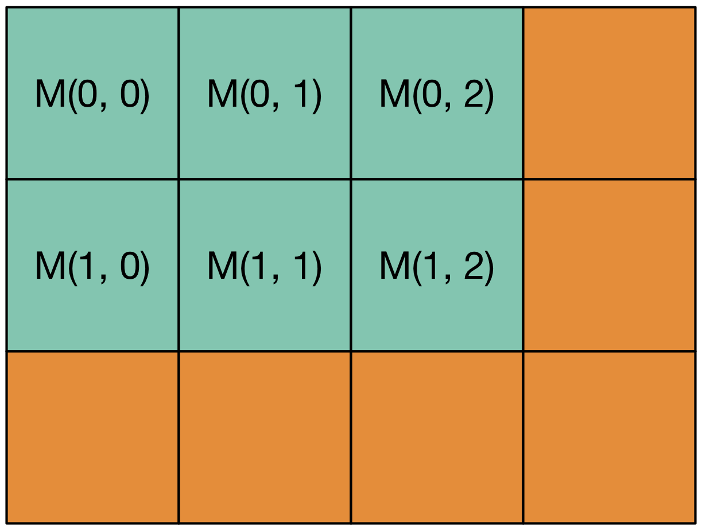
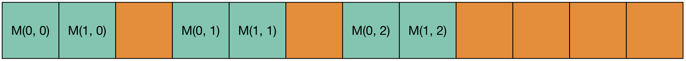
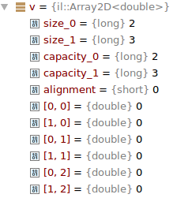

.. role:: cpp(code)

    :language: cpp

Array2D
=======

Overview
--------

We provide a two-dimensional dynamic array :cpp:`il::Array2D<T>` that stores its
element in column-major order, also known as Fortran order: the elements
:cpp:`a(i0, i1)` and :cpp:`a(i0 + 1, a1)` are stored next to each other in
memory. This array is quite similar to the linear array :cpp:`il::Array<T>` in
many ways: it owns its memory, its size can be dynamically changed, and it
provides capacities in both dimension which also both more efficient resizing
and padding for those who are concerned about memory alignement.

Let's start with our first example where we create such an object which will be
interpreted as a matrix:

.. code-block:: cpp

    #include <il/Array2D.h>

    const il::int_t n = 100;
    il::Array2D<double> M{n, 2 * n};
    for (il::int_t j = 0; j < M.size(1); ++j) {
      for (il::int_t i = 0; i < M.size(0); ++i) {
        M(i, j) = 1.0 / (2 + i + j);
      }
    }

We have created a matrix with 100 rows and 200 columns. Our container provides
sizes for both dimensions which can be accessed with the :cpp:`size(0)` and
:cpp:`size(1)` methods which return an integer of type :cpp:`il::int_t`. The
array is stored in column-major order. As a consequence, this code can
be vectorized efficiently by most compilers.

In order to clearly understand how a :cpp:`il::Array2D<T>` array is layed out
in memory, here is such an array that as a size of 2 and a capacity of 3 in the
first dimension (the rows for a matrix), and a size of 3 and a capacity of 4
in the second dimension (the columns for a matrix)

And here is how this array is layed out in memory

As you can see, the elements :cpp:`M(i0, i1)` and :cpp:`M(i0 + 1, i1)` are
close to each other in memory. But, if the capacity is different from the size
in the first dimension, there might be a gap in between the last element of
the first column and the first element of the second column. This property
could me very useful if you want to resize efficiently your array, but it is
also needed for people who want to get the very best from memory transfer and
vectorization: these people might need to have the first element of teach column
at the beginning of a cacheline. Our two-dimensional array implementation allows
this kind of optimization.

There are many different use cases for such a two-dimensional array. The most
common ones are described below:

- **Matrix**. In scientific computing, the most common usage for a
  two-dimensional array is a matrix. Matrices can be stored in column-major
  order or row-major order and :cpp:`il::Array2D<T>` uses the column-major
  order. This should be your preferred way to store matrices. Even though the
  same performance can we achieved with column-major and row-major order
  matrices, most numerical libraries have been optimized for column-major order
  storage and some of them still gives better performance for this storage.

- **Images**. Images are also commonly stored in two dimensional arrays. For
  instance, a grayscale landscape image with a width of 1000 pixels and a height
  of 500 pixels can be stored in a
  :cpp:`il::Array2D<unsigned char> img{1000, 500}` array. To access the pixel
  at position :cpp:`(x, y)` in the image, all you need is to type
  :cpp:`img(x, y)`. The usual convention is that pixels are stored from left
  to right within one row of the image, and that rows are stored from'
  the top to the bottom of the image. For instance, the pixel at the top left
  corner of the image is :cpp:`img(0, 0)` and the pixel at the bottom right
  corner of the image is :cpp:`img(999, 499)`. Even though, it gives you the
  feeling of working upside down, most libraries store image in such a way for
  historical reasons.

  .. image:: array2d-image.png
      :scale: 80 %
      :alt: alternate text
      :align: center

  Again, the Fortran order is the right order as :cpp:`img(x, y)` and
  :cpp:`img(x + 1, y)` are next to each other in memory.

- **Data**. You can store more general data in an `il::Array2D<T>`. For
  instance, imagine that you need to store in memory 1000 points of the 3
  dimensional space. It might be a very good idea to store those elements in
  a :cpp:`il::Array2D<float>`.

  .. code-block:: cpp

      #include <il/Array2D.h>

      const il::int_t nb_points = 1000;
      const il::int_t dim = 3;
      il::Array2D<float> point{nb_points, dim};

  If you want to access the x-coordinate of the point of index :cpp:`i`, all
  you have to do is type :cpp:`point(i, 0)`. Bare in mind that, as
  :cpp:`il::Array2D<T>` stores element in Fortran order, in memory, you'll find
  all the x-coordinates of the points, then all the y-coordinates of the points
  and finally all the z-coordinates of the points. This seem surprising at first
  as most people expect to have the coordinates of a given point next to each
  other, but this layout, also known as the "structure of arrays" layout is
  the most efficient for many algorithms.

As you can see, unlike many linear algebra libraries out there,
:cpp:`il::Array2D<T>` has been designed to hold different kind of data. Even
though we also provide a :cpp:`il::Array2C<T>` container that stores data in
row-major order (also known as C-major order), we encourage you to use
this data structure which is at least as efficient and sometimes more efficient
in most cases.

Construction
------------

There are many different ways to construct a :cpp:`il::Array2D<T>`.

1. The default constructor construct a :cpp:`il::Array2D<T>` of size 0 and
   capacity 0 in both dimensions. It does not allocate any memory and is
   extremely fast.

   .. code-block:: cpp

       #include <il/Array2D.h>

       il::Array2D<unsigned char> v{};

2. It is also possible to construct a :cpp:`il::Array2D<T>` giving its sizes
   in both dimensions :cpp:`n0` and :cpp:`n1`. An array of these sizes will
   be constructed. Most of the time, the capacity will be set respectively to
   :cpp:`n0` and :cpp:`n1`, but this is something you cannot count on as
   some parameters of the library might have been tweaked to align memory
   and create a larger capacity in the first dimension.

   .. code-block:: cpp

       #include <il/Array2D.h>

       const il::int_t n0 = 1000;
       const il::int_t n1 = 500;
       il::Array2D<unsigned char> img{n0, n1};

   As with :cpp:`il::Array<T>`, the initialization behavior of the elements
   depends upon the type :cpp:`T`.

   - For numeric types such as :cpp:`bool`, :cpp:`unsigned char`, :cpp:`char`,
     :cpp:`int`, :cpp:`il::int_t`, :cpp:`float`, :cpp:`double` the memory should
     be considered as uninitialized. Therefore, for such arrays, reading the
     element :cpp:`img(x, y)` before it has been set results in undefined
     behaviour. In practice:

     - In *release mode*, the memory is left *uninitialized*.
     - In *debug mode*, the memory is set to a special value that makes bugs
       that come from noninitialization easier to track. Floating point types
       are set to :cpp:`NaN` and integers are set to the largest number
       :cpp:`1234...` that the type can hold.

   - For objects, the elements are default constructed. As a consequence they
     are properly initialized. As a consequence, this constructor must be called
     with types :cpp:`T` with a default constructor. However, the
     :cpp:`il::Array2D<T>` container also comes with constructors and methods that
     works with types that do not provide any default constructor.

3. One can also explicitly ask to construct an array of sizes :cpp:`n0` and
   :cpp:`n1` with a default value supplied as a second argument. For instance,
   if you want to create an array of floating point with all the elements
   initialized to :cpp:`0.0`, one can use the following code:

   .. code-block:: cpp

       #include <il/Array2D.h>

       const il::int_t n = 1000;
       il::Array2D<double> a{n, n, 0.0};

4. The previous constructor is only available for types that can be copied.
   Unfortunately, there are some types such as :cpp:`std::atomic<int>` that
   cannot be copied. Other types may be expensive to copy. As a consequence,
   another constructor is available where you do not provide a default object,
   but arguments to construct this default object.

   .. code-block:: cpp

       #include <atomic>
       #include <il/Array2D.h>

       const il::int_t n = 1000;
       il::Array2D<std::atomic<int>> a{n, n, il::emplace, 0};

5. Finally, in case you want to explicitly initialize the element to a list of
   values, the following constructor can be used.

   .. code-block:: cpp

       #include <il/Array2D.h>

       il::Array2D<double> M{il::value, {{0.0, 1.0}, {2.0, 3.0}, {4.0, 5.0}}

   This code creates a matrix :cpp:`M` with 2 rows and 3 columns. The entries
   are given column after column. As a consequence we will get the following
   matrix:

   .. image:: array2d-small-matrix.png
      :scale: 20 %
      :alt: alternate text
      :align: center

Arrays own their memory. As a consequence, it is impossible to construct an
array from a pointer that has been allocated by :cpp:`malloc`, :cpp:`new` or
any other library. If you want to warp such a pointer inside an InsideLoop
object, the type you are looking for are :cpp:`il::ArrayView2D<T>` and
:cpp:`il::ArrayEdit2D<T>`.

Copy construction and assignement
---------------------------------

Copy construction and assigment works in the same way as :cpp:`il::Array<T>`.
The identity of an :cpp:`il::Array2D<T>` object is defined by its sizes in both
dimensions and the elements it holds. As a consequence, when you copy construct
an two-dimensional array, you are guarenteed to have a new array with the same
sizes as the original and with elements that compare equal. The same warning
is still true for capacities which are not part of the identity of the object
and therefore are usually not conserved during a copy or an assignement.

Destruction
-----------

The destruction of a two-dimensional array releases its memory. If :cpp:`T` is a
class, all the objects contained in the array will be destructed in an
unspecified order before the memory is released.

Accessing the elements
----------------------

1. **Read access with the parenthesis operator**.
   The method :cpp:`size(il::int_t d)` returns the size of the two-dimensional
   array along dimension :cpp:`d` as an :cpp:`il::int_t`. The elements can be
   accessed through the parenthesis operator. For instance, here is a code
   that walks an image on the row :cpp:`y` and walks from right to left and
   returns the psition of the first white pixel (with a value larger than 128).

   .. code-block:: cpp

       #include <il/Array2D.h>

       il::int_t findWhite(const il::Array<unsigned char>& img, il::int_t y) {
         IL_EXPECT_FAST(y >= 0 && y < img.size(1));

         for (il::int_t x = img.size(0) - 1; x >= 0; --x) {
           if (img(x, y) >= 128) {
             return x;
           }
         }
         return -1;
       }

   Accessing elements out of bound is forbidden. The behavior of the library is
   different, wether we are in debug mode or in release mode.

   - *Debug mode*: In debug mode, the library will call :cpp:`std::abort()`
     which will let you easily find the culprit with a debugger.
   - *Release mode*: In release mode, no bounds checking is done and accessing
     arrays out of bounds will result in undefined behavior. But this will
     let the compiler do a lot of optimization, such as vectorization which would
     be impossible in C++ with bounds checking.

2. **Write access with the parenthesis operator**.
   The parenthesis operator can also be used on a arrays for write access. For
   instance, here is some code that creates a Hilbert matrix:

   .. code-block:: cpp

       #include <il/Array2D.h>

       il::Array2D<double> hilbert(il::int_t n) {
         il::Array2D<double> H{n, n};

         for (il::int_t i1 = 0; i1 < n; ++i1) {
           for (il::int_t i0 = 0; i0 < n; ++i0) {
             H(i0, i1) = 1.0 / (2 + i0 + i1);
           }
         }

         return H;
       }

   Note how we carefuly fill the matrix column after column in order to
   make the job easier for processor and the memory. The loops would be much
   less efficients if they were swaped.

Unfortunately, there is no efficient way to traverse a multidimensional array
with iterators when those arrays are allowed to have paddings. As a consequence,
the :cpp:`il::Array2D<T>` object cannot be traversed with range-based for
loops available in C++11.

Operations that change the size of an Array2D
---------------------------------------------

The size of an two-dimensional array can be changed with the :cpp:`Resize`
method:

1. **The semantics of Resize**.
   You can change the size of an array using the method :cpp:`Resize`

   .. code-block:: cpp

       #include <il/Array2D.h>

       il::Array2D<double> a{il::value, {{2.0, 5.0}, {7.0, 1.0}};
       a.Resize(1, 3);

   Both dimensions can be reduced or extended and all the elements that belong
   to both extents of the array are kept. In this case, the array is transformed
   from a 2 by 2 matrix to a 1 by 3 matrix. The first 2 elements of the new
   matrix are the ones that were already available, but the new one is left
   uninitialized (or set to a distinctive element in debug mode) as we are
   dealing with a numeric type. If :cpp:`T` were an object, the new element
   would have been default constructed.

   .. image:: array2d-resize.png
      :scale: 20 %
      :alt: alternate text
      :align: center

   If the new sizes are both within the capacity of the original array, no
   reallocation is needed. But, when this is not the case, a reallocation of
   the array is done.

   One can also specify an element to be used to fill the new elements of the
   array. For instance, with the same array, with the following code

   .. code-block:: cpp

       #include <il/Array2D.h>

       il::Array2D<double> a{il::value, {{2.0, 5.0}, {7.0, 1.0}};
       a.Resize(1, 3, 3.14);

   we go from the left matrix to the right one.

   .. image:: array2d-resize-bis.png
       :scale: 20 %
       :alt: alternate text
       :align: center

   For objects that cannot be copied, we also provide a method where we provide
   the arguments of the constructor for the newly created objects.

    .. code-block:: cpp

       #include <atomic>
       #include <il/Array2D.h>

       il::Array2D<std::atomic<int>> a{};
       a.Resize(2, 2, il::emplace, 1);

2. **Avoiding reallocation with the capacity**
   As with linear arrays, two-dimensional arrays provide capacities in both
   dimensions. For better performance, it might be useful to play with the
   capacities, in order to avoid the number or reallocation. This is done with
   the :cpp:`Reserve` method that takes two :cpp:`il::int_t` integers
   as capacities and that reallocates (if necessary) the array such that after
   this call

   .. code-block:: cpp

       #include <il/Array2D.h>

       il::Array2D<float> point{};
       ...
       point.Reserve(r0, r1);

   our array have capacities at least equal to :cpp:`r0` and :cpp:`r1`
   respectively. Note that those capacities could be larger after the call,
   either because the capacties were already larger than those numbers, or for
   alignement purposes.

   Imagine for
   instance that you generate randomly :cpp:`n` points in the plane and you
   want to save those such that :math:`x + y \geq 0` in an array. Roughly,
   you should get about half of those points. As a consequence, it might be
   a good idea to reserve the size of your array upfront.

    .. code-block:: cpp

       #include <random>
       #include <il/Array2D.h>

       il::int_t n = 100000;
       il::Array2D<float> point{0, 2};
       point.Reserve(n / 2, 2);

       std::default_random_engine engine{};
       std::uniform_real_distribution<float> distribution{-1.0f, 1.0f};
       for (il::int_t k = 0; k < n; ++k) {
         float x = distribution(engine);
         float y = distribution(engine);
         if (x + y >= 0.0f) {
           il::int_t n = point.size(0);
           point.Resize(n + 1, 2);
           point(n, 0) = x;
           point(n, 1) = y;
         }
       }

View/Edit of an Array2D
-----------------------

1. **ArrayView**.
   It is often useful to work with a view or a subview of a matrix. A view to
   a two-dimensional array does not own is memory and should be treated like
   a point to some raw memory that also knows the size of the array. Views are
   cheap to copy because the library does not need to copy the elements they
   give access to: they alias memory. For instance, the following code

   .. code-block:: cpp

       #include <iostream>
       #include <il/Array2D.h>

       il::int_t n = 10;
       il::Array2D<double> A{n, n, 0.0};
       il::Array2DView<double> v = A.view();

       std::cout << "Before: " << v(0, 0) << std::endl;
       A(0, 0) = 1.0;
       std::cout << "After: " << v(0, 0) << std::endl;

   prints :cpp:`Before: 0.0` and :cpp:`After: 1.0`. Be aware that, because of
   reallocation, any change to the size or the capacity of :cpp:`A` might
   invalidate the view :cpp:`v`.

   Views can also be used to access par of a matrix. For instance, the
   following code gives access to a submatrix of our original matrix.

   .. code-block:: cpp

       #include <iostream>
       #include <il/Array2D.h>

       il::int_t n0 = 3;
       il::int_t n1 = 4;
       il::Array2D<double> A{n0, n1, 0.0};
       il::Array2DView<double> v = A.view(il::Range{1, n0}, il::Range{1, n1});

       A(1, 1) = 3.14159;
       std::cout << "View: " << v(0, 0) << std::endl;

   The previous code prints :cpp:`3.14159`.

   On can also generate a view of a column or a subcolumn. For instance, the
   following code gives access to the second column of our matrix

   .. code-block:: cpp

       #include <iostream>
       #include <il/Array2D.h>

       il::int_t n0 = 3;
       il::int_t n1 = 4;
       il::Array2D<double> A{n0, n1, 0.0};
       il::ArrayView<double> v = A.view(il::Range{0, n0}, 1);

       A(1, 1) = 3.14159;
       std::cout << "View: " << v[1] << std::endl;

   and prints :cpp:`View: 3.14159`.

2. **ArrayEdit**.
   It is also possible to create an :cpp:`il::Array2DEdit<T>` or a
   :cpp:`il::ArrayEdit<T>` from an array using the :cpp:`Edit` methods. They
   provide write access to the underlying arrays.

Raw access for C functions
--------------------------

When working with other C++ libraries or librairies written in other languages
it might be useful to get raw access to the underlying array. This can
be done with the the :cpp:`data()` and the :cpp:`Data()` methods. The first
one gives access to a :cpp:`const T*` useful if you only need read access to
the elements of the array. The second one is useful if you need to have
write access to the array. The element of indices :cpp:`(i0, i1)` of the
two-dimensional array :cpp:`a` is available at position
:cpp:`a.data() + i1 * a.stride(1) + i0`. For instance, if :cpp:`A`, :cpp:`B`
and :cpp:`C` are 3 matrices, the folowing call to the BLAS function can be used
to multiply :cpp:`A` by :cpp:`B` store the result in :cpp:`C`.

.. code-block:: cpp

   #include <il/Array2D.h>
   #include <mkl_cblas.h>

   int n0 = 500;
   int n1 = 1000;
   int n2 = 1500;
   il::Array2D<double> A{n0, n1, 0.0};
   il::Array2D<double> B{n1, n2, 0.0};
   il::Array2D<double> C{n0, n2};

   cblas_dgemm(CblasColMajor, CblasNoTrans, CblasNoTrans, n0, n2, n1, 1.0,
               A.data(), static_cast<int>(A.stride(1)),
               B.data(), static_cast<int>(B.stride(1)),
               0.0, C.Data(), static_cast<int>(C.stride(1)));

Bare in mind that the InsideLoop library provides wrapper around those functions
and that you should not call directly the C BLAS functions yourself.

Debugger
--------

Much like :cpp:`il::Array<T>`, we provide debugging facilities for
:cpp:`il::Array2D<T>`. Here is how an :cpp:`il::Array2D<T>` looks like from
CLion under Linux running the :cpp:`Gdb` debugger.

